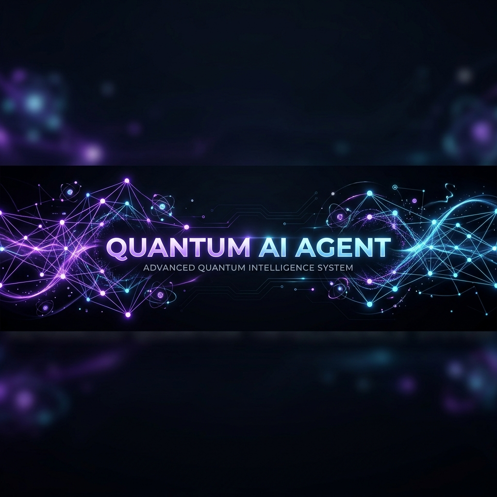

# 🌌 Quantum AI Agent: Structured Inference Engine



<div align="center">
  <h3>✨ Next-Generation AI Assistant ✨</h3>
  <br />
  <a href="https://quantumquery-ai-agent.onrender.com/">
    
  </a>
  <br />
  <br />
  <p align="center">
    <a href="https://github.com/Chiranjeeb-Dash-Git/QuantumQuery-AI-Agent">🧬 <strong>Source Code</strong></a> • 
    <a href="https://quantumquery-ai-agent.onrender.com/">💻 <strong>Hosted App</strong></a>
  </p>
</div>

<p align="center">
  
  
  
  
</p>

---

### **Quantum AI Agent** is a state-of-the-art multi-modal reasoning engine designed for ultra-low latency insights. Designed by **Chiranjeeb Dash**, this application leverages the lightning-fast inference of **Groq**, **OpenAI**, and **Google Gemini** through a unified **LangChain** orchestration layer.

---

## 🚀 Key Features

### ⚡ **Multi-Model Orchestration**
Switch between **Groq (Llama-3)**, **OpenAI (GPT-4o)**, and **Google (Gemini 2.0)** instantly from the dashboard. Each provider is optimized for structured reasoning and tool-calling.

### 🔍 **Real-Time Web Intelligence**
Integrated with **Tavily Search**, the agent breaks through training-cutoff barriers by fetching live web data, complete with clickable sources and hostname references.

### 🏛️ **Structured Reasoning (LCEL)**
Uses **LangChain Expression Language (LCEL)** to determine tool-usage requirements and synthesize final answers into validated JSON schemas for perfect front-end rendering.

### 🧪 **Modern Quantum UI**
A premium dashboard built with **Next.js 16 (App Router)** and **Tailwind CSS 4**.
- **Interactive Model Selection**: Switch providers on-the-fly.
- **Animated Blobs & Glassmorphism**: For a truly cybernetic aesthetic.
- **Copy Insight**: One-click raw data export.
- **Persistent Memory**: Local storage-based chat history.

---

## 🛠️ Technology Stack

| Layer | Technology |
| :--- | :--- |
| **Frontend** | Next.js 16, React 19, Lucide Icons |
| **Styling** | Tailwind CSS 4, Radix UI, Motion |
| **Orchestration** | LangChain Core, LCEL |
| **Search Engine** | Tavily Tool Integration |
| **Providers** | Groq LPU, OpenAI, Google Gemini |

---

## 📂 Project Structure

```bash
root/
├── src/
│   ├── app/          # Next.js App Router (UI & API)
│   ├── lib/ai/       # AI Reasoning Engine & Model Adapters
│   └── components/   # Premium UI Components (Shadcn)
├── public/           # Static Assets & Banner
├── .env.local        # Security Credentials
└── package.json      # Dependencies & Scripts
```

---

## ⚙️ Getting Started

### 1. Prerequisites
- Node.js (v18+)
- API Keys: `GROQ_API_KEY`, `TAVILY_API_KEY`, `OPENAI_API_KEY`, `GEMINI_API_KEY` (as needed).

### 2. Installation
```bash
npm install
```

### 3. Environment Configuration
Create a `.env.local` file in the root directory:

```env
GROQ_API_KEY=your_key
TAVILY_API_KEY=your_key
OPENAI_API_KEY=your_key
GEMINI_API_KEY=your_key
```

### 4. Launch the Engine
```bash
npm run dev
```
Open [http://localhost:3000](http://localhost:3000) to witness the quantum shift.

---

## 👨‍💻 Author

**Chiranjeeb Dash**
- [LinkedIn](https://www.linkedin.com/in/chiranjeeb-dash/)
- [GitHub](https://github.com/chiranjeebdash)

---

## 📄 License

This project is licensed under the MIT License - see the [LICENSE](LICENSE) file for details.

---

<p align="center">
  <i>"Redefining the speed of thought."</i>
</p>
